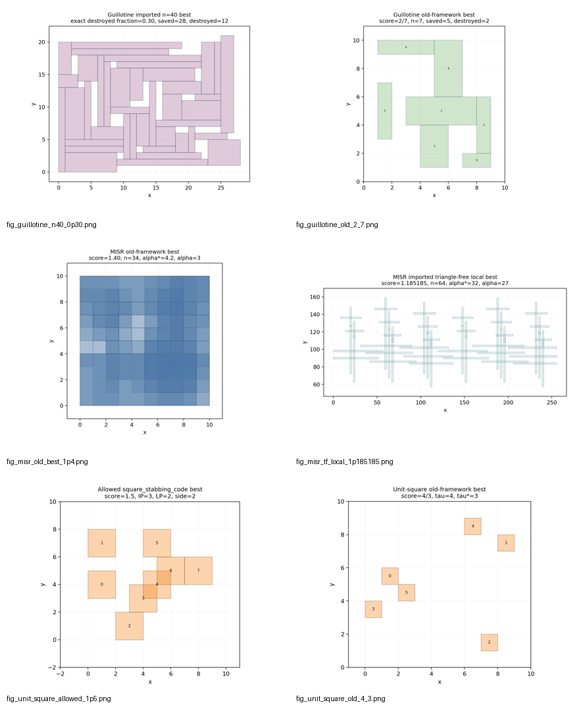
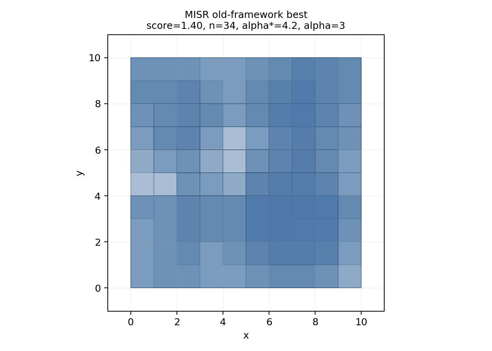
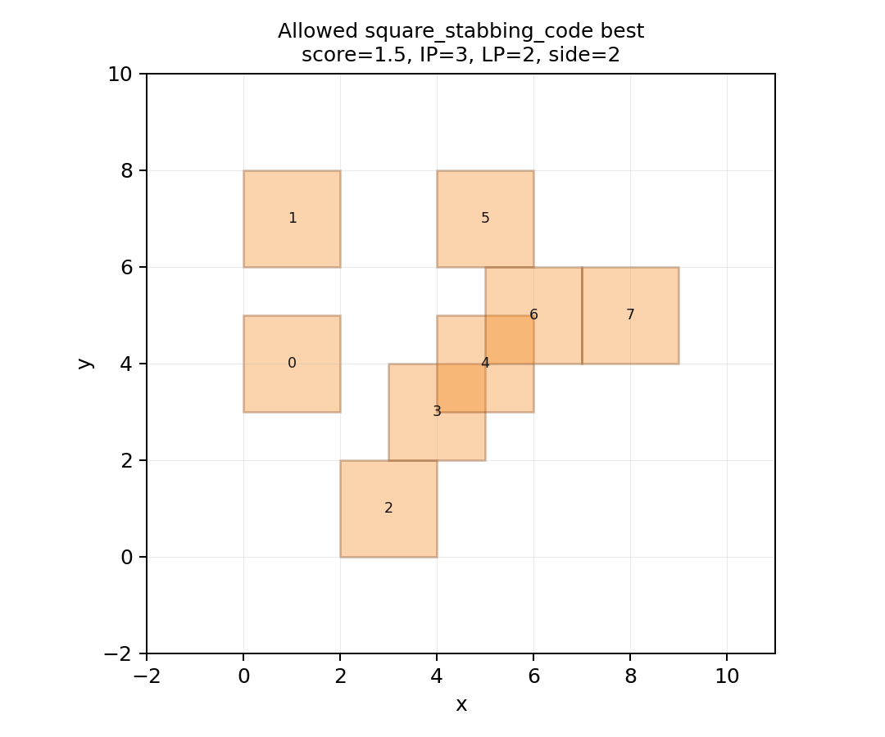
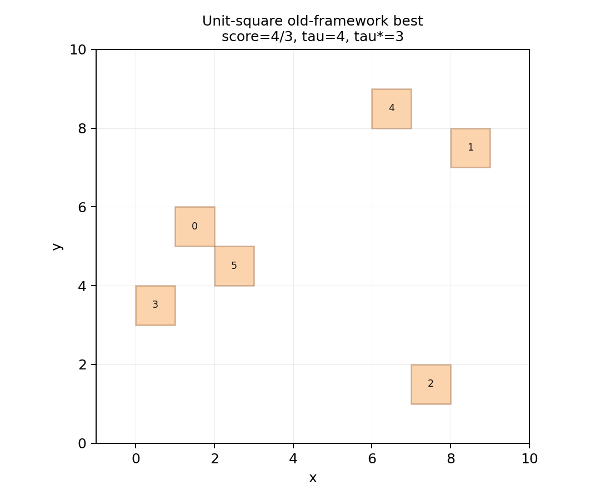
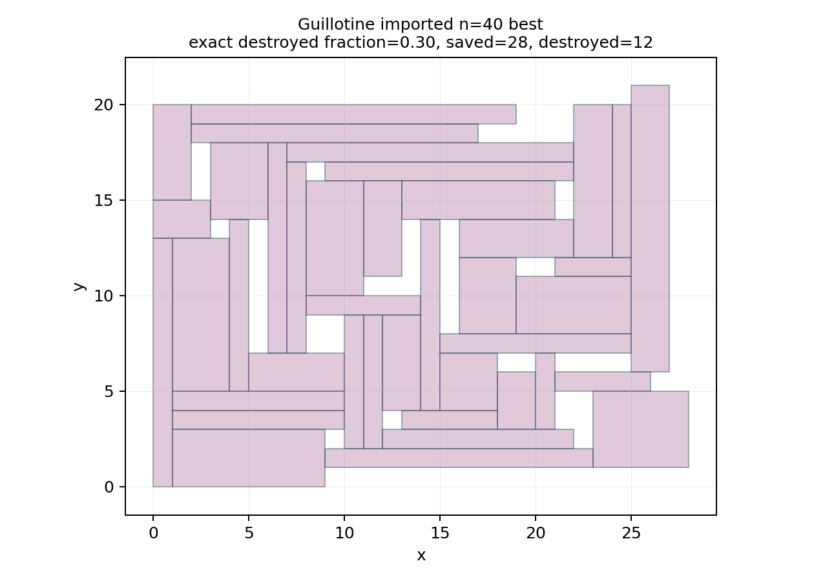
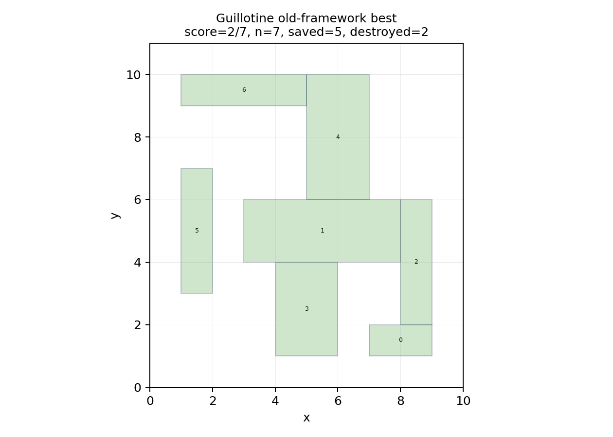

# PatternBoost Three-Problem Experiment Report

Updated: 2026-07-04  
Scope: `misr`, `unit_square`, and `guillotine` only  
Repository: `patternboost-multilevel`

This report summarizes the current PatternBoost experiment state, the best
audited results, the strategies used for each problem, what appears to be
working, and what should be improved next. It is intended as a clean handoff
document for continuing the project, not as a final publication table.

The active scope intentionally excludes `epsilon_net`, `graph_separation`, and
all evidence from the discarded `square-stabbing-14-9` package. In particular,
the excluded `14/9` and `20/13` square-stabbing values are not used here.

## Executive Summary

The current codebase can run the full three-problem, 81-row PatternBoost matrix
on NYUAD Jubail and can verify reported certificates with exact scorers. The
best current values are:

| Problem | Best audited value | Main source | Certificate scale | Status |
| --- | ---: | --- | --- | --- |
| MISR LP gap | `1.4` | previous-best warm-start | 14 rectangles in the warm-start row; archived certificate has 34 rectangles | exact LP/ILP certificate |
| Unit-square stabbing | `1.5000000000000004` | broad 81-row run and warm-start | 20-23 squares in current-code rows; allowed imported artifact also has exact `3/2` | exact IP/LP certificate |
| Guillotine hardness | `0.3` | previous-best warm-start and exact n=40 audit artifact | 10 rectangles in warm-start row; exact n=40 artifact destroys 12 | exact recursive DP audit |

The main scientific lesson is that generic coordinate mutation is not enough.
The useful progress comes when the representation and surrogate closely match
the certificate:

- MISR improves when the search directly optimizes exact LP-gap pressure and
  uses triangle-free or sparse-conflict structure as a constraint or prior.
- Unit-square stabbing improves when the search works with line-square
  incidence and exact set-cover scoring, not just raw square coordinates.
- Guillotine improves when the search targets recursive nonseparability and
  exact saved-set witnesses, not only first-cut obstruction.

The current numbers are real but modest. The project has not yet crossed the
desired higher barriers in the current allowed evidence path.

## Evidence Boundaries

The project has several kinds of evidence. They should not be mixed.

| Evidence type | Use in this report | Notes |
| --- | --- | --- |
| Current-code audited summaries | Primary evidence | These are the safest values to cite for current experiments. |
| Previous-best warm-start runs | Primary follow-up evidence | Useful for record recovery, but not a neutral ablation. |
| Broad 81-row matrix | Diagnostic evidence | One no-seed-axis sweep over all component combinations. |
| Imported allowed unit-square code | Allowed comparison evidence | `square_stabbing_code.zip` is allowed. |
| Discarded `square-stabbing-14-9` code | Excluded | Do not quote `14/9`, `20/13`, or figures from that package. |
| Historical claims without recovered certificates | Targets only | Values such as earlier `1.5` MISR should be recovered and audited before citation. |

The experiment matrix has no repeated seed axis. Each row is a distinct
configuration and records randomness for reproducibility, but the current
tables should be read as discovery and diagnostic results rather than
statistical estimates over many independent seeds.

## Visual Overview

The curated construction figures are kept in `docs/assets/study_assets/`.



The individual figures used below are visual diagnostics only. The certificate
JSON files and exact verifiers are the evidence.

## Run Inventory

### Previous-Best Warm-Start Run

- Slurm job: `16493282`
- Run root: `runs/hpc_prevbest_12_4h_min8_resume_20260703_111657`
- Status: `12/12 COMPLETED`
- Stderr: `0` nonempty files
- Stop reason: all rows ended by `budget_exhausted`
- Resume status: all rows had `resumed_from_checkpoint=True`
- Elapsed time: about `14402-14412` seconds per row

Best rows from this run:

| Problem | Score | Iteration | Representation | Local search | Surrogate | Size/details |
| --- | ---: | ---: | --- | --- | --- | --- |
| `misr` | `1.4` | `7924` | `triangle_free_rect` | `lp_dual_pivot` | `exact_lp_gap_pressure` | 14 rectangles |
| `unit_square` | `1.5000000000000004` | `6687` | `line_square_incidence` | `coord_mutation` | `exact_stab_gap_pressure` | 23 squares, `tau_int=4` |
| `guillotine` | `0.3` | `14556` | `rect_direct_disjoint` | `packing_resize` | `k_subset_nonseparability` | 10 rectangles, 3 destroyed |

Full warm-start rows:

| Problem | Score | Iteration | Representation | Local search | Surrogate | Notes |
| --- | ---: | ---: | --- | --- | --- | --- |
| `misr` | `1.4` | `7924` | `triangle_free_rect` | `lp_dual_pivot` | `exact_lp_gap_pressure` | best MISR row |
| `misr` | `1.375` | `8049` | `triangle_free_rect` | `lp_dual_pivot` | `triangle_free_exact_gap_pressure` | near-best |
| `misr` | `1.375` | `6286` | `triangle_free_rect` | `program_coeff_pivot` | `exact_lp_gap_pressure` | near-best |
| `misr` | `1.375` | `5426` | `triangle_free_rect` | `sequence_pair_pivot` | `triangle_free_exact_gap_pressure` | near-best |
| `unit_square` | `1.5000000000000004` | `6687` | `line_square_incidence` | `coord_mutation` | `exact_stab_gap_pressure` | size 23, `tau_int=4` |
| `unit_square` | `1.5000000000000004` | `8679` | `square_direct` | `coord_mutation` | `exact_stab_gap_pressure` | size 22, `tau_int=4` |
| `unit_square` | `1.4285714285714288` | `5118` | `sqstab_exact_grid` | `coord_mutation` | `exact_stab_gap_pressure` | size 12, `tau_int=4` |
| `unit_square` | `1.4285714285714288` | `8483` | `square_direct` | `primal_dual_lines` | `exact_stab_gap_pressure` | size 30, `tau_int=4` |
| `guillotine` | `0.3` | `14556` | `rect_direct_disjoint` | `packing_resize` | `k_subset_nonseparability` | size 10, destroyed 3 |
| `guillotine` | `0.25` | `1199` | `recursive_obstruction_grammar` | `recursive_gadget_assembly` | `depth_limited_dp` | size 8, destroyed 2 |
| `guillotine` | `0.25` | `2768` | `recursive_obstruction_grammar` | `recursive_gadget_assembly` | `first_cut_obstruction` | size 8, destroyed 2 |
| `guillotine` | `0.25` | `508` | `recursive_obstruction_grammar` | `recursive_gadget_assembly` | `k_subset_nonseparability` | size 8, destroyed 2 |

### Broad 81-Row Run

- Slurm job: `16492548`
- Run root: `runs/hpc_81_4h_min8_train7_n12_venv_20260703_101409`
- Matrix: `3 problems x 3 representations x 3 local searches x 3 surrogates = 81 rows`
- Status: `71/81` rows completed
- Timeout rows: 10, all `guillotine`
- Checkpoints: all 81 rows had checkpoints
- Stderr: nonempty stderr files contained Slurm time-limit messages only

Broad-run best rows:

| Problem | Best score | Configuration | Details |
| --- | ---: | --- | --- |
| `misr` | `1.3333333333333333` | `triangle_free_rect / sequence_pair_pivot / exact_lp_gap_pressure` | size 16 |
| `unit_square` | `1.5000000000000004` | `line_square_incidence / coord_mutation / exact_stab_gap_pressure` | size 20, `tau_int=4` |
| `guillotine` | `0.16666666666666666` | `rect_direct_disjoint / recursive_gadget_assembly / first_cut_obstruction` | size 12, destroyed 2 |

The broad run is useful for component comparison, but it should not be treated
as a complete publication table because 10 guillotine rows timed out. Those
timed-out guillotine checkpoint values were all weaker than the warm-start
`0.3` row.

## Problem 1: MISR LP-Gap Search

### Objective

For a rectangle family `R`, the MISR score is:

```text
alpha_lp(R) / alpha_int(R)
```

Here `alpha_int` is the exact maximum number of pairwise-disjoint rectangles,
and `alpha_lp` is the exact LP relaxation value using clique or point
constraints. The final score must come from the exact verifier.

### Current Best

Current best value:

```text
1.4
```

The warm-start run recovered this score in the current code path with:

```text
triangle_free_rect / lp_dual_pivot / exact_lp_gap_pressure
```

The archived visual certificate shown below records a related old-framework
MISR best with exact components:

- `n = 34`
- `alpha_lp = 4.200000000000002`
- `alpha_int = 3`
- score `1.4000000000000006`



### Strategies Used

| Strategy | What it does | What happened |
| --- | --- | --- |
| Endpoint or sequence-pair geometry | Encodes rectangle endpoint order rather than only raw coordinates | Promising structurally, but not yet the strongest recovered row. |
| `triangle_free_rect` representation | Biases candidates toward sparse or triangle-free conflict structure | Produced the strongest current warm-start MISR rows. |
| `lp_dual_pivot` local search | Uses LP pressure and tight constraints to decide which rectangles to perturb | Clearly better aligned with the objective than unguided mutation. |
| `exact_lp_gap_pressure` surrogate | Ranks candidates by the true LP-gap objective when feasible | Best current MISR row uses it. |
| `graph_conflict_proxy` surrogate | Uses graph statistics as a cheaper proxy | Useful for speed, but less reliable for final quality. |

### Interpretation

The strongest MISR behavior appears when the search is guided by the exact LP
gap rather than by generic graph density. The gap is sensitive to two quantities
at once: the LP value must stay high while the exact independent set remains
small. The best current examples are in the small-denominator regime, where
`alpha_int` is around 3; in that regime every fractional LP improvement matters.

The likely reason the search is not crossing stronger barriers is that it has
not yet found a scalable family. It can recover and perturb finite certificates,
but it does not yet reliably compose them while preserving the LP/integral
imbalance.

### What To Improve

1. Split MISR into two explicit tracks:
   - unrestricted LP-gap record search;
   - triangle-free or sparse-conflict MISR search.
2. Add exact LP-dual features to the triangle-free generator, not just
   triangle-free feasibility.
3. Mine motifs from the `1.4` certificate and use them as mutation templates,
   while still starting normal matrix rows from random candidates.
4. Add a composition test: after a motif is duplicated or lifted, verify that
   `alpha_int` does not grow as fast as `alpha_lp`.
5. Recover and audit any historical `1.5` MISR certificate before citing it.

## Problem 2: Unit-Square Stabbing

### Objective

For a finite set of unit squares `S`, the score is:

```text
tau_int(S) / tau_lp(S)
```

Here `tau_int` is the exact minimum number of horizontal and vertical lines
that stab all squares, and `tau_lp` is the LP relaxation of the same set-cover
problem over the compressed critical-line universe.

### Current Best

Current best value:

```text
1.5000000000000004
```

The strongest current-code rows use exact stabbing pressure:

```text
line_square_incidence / coord_mutation / exact_stab_gap_pressure
square_direct / coord_mutation / exact_stab_gap_pressure
```

The allowed imported unit-square artifact also records an exact `3/2` result:

- exact IP `3`
- exact LP `2`
- gap `1.5`
- hash `8e867b64bde38625`



For comparison, the old generic framework had a smaller `4/3` example:



### Strategies Used

| Strategy | What it does | What happened |
| --- | --- | --- |
| `square_direct` | Mutates square coordinates directly | Can recover `1.5` when paired with exact stabbing pressure. |
| `line_square_incidence` | Represents the incidence relation between candidate lines and squares | Best broad-run unit-square row used this representation. |
| `sqstab_exact_grid` | Searches more directly in a grid/incidence model | Reached `1.428571...` in the warm-start rows. |
| `coord_mutation` | Moves square positions across critical thresholds | Strongest current rows use it, probably because exact scoring corrects bad moves quickly. |
| `primal_dual_lines` | Uses line-cover information to guide local moves | Promising, but not the top row in the current snapshot. |
| `exact_stab_gap_pressure` | Exact set-cover IP/LP pressure | Dominates the best current unit-square rows. |

### Interpretation

The unit-square problem is fundamentally a set-cover gap problem disguised as
geometry. The old raw-coordinate search was weak because most coordinate moves
do not preserve or amplify the incidence obstruction. The better code paths
work because they focus on the critical line-square incidence matrix and score
with exact IP/LP pressure.

The current `1.5` value is meaningful, but it is also a plateau. It corresponds
to a compact `3/2` gap. Beating it likely requires a structured family rather
than more random local perturbation.

### What To Improve

1. Keep the discarded `square-stabbing-14-9` package excluded.
2. Reimplement only mathematically legitimate ideas inside the allowed code
   path: staircase, ladder, cyclic threshold, and incidence-preserving
   generators.
3. Add certificate export with:
   - square coordinates;
   - compressed critical-line universe;
   - exact integer stabbing set;
   - LP primal and dual witnesses;
   - canonical hash;
   - rendering.
4. Add mutations that preserve high-value incidence structure:
   - move a square only if it keeps multiple active candidate lines;
   - duplicate a square family layer only if the LP support remains balanced;
   - penalize dominating lines that stab too many squares.
5. Treat `1.5` as the immediate barrier to beat in the allowed code path.

## Problem 3: Recursive Guillotine Hardness

### Objective

For a disjoint rectangle family `R`, the guillotine score is:

```text
1 - max_saved(R) / |R|
```

Here `max_saved(R)` is the maximum number of rectangles that can be preserved
by an optimal recursive guillotine-cut strategy. Equivalently, the score is the
minimum destroyed fraction forced by the best exact recursive attack.

### Current Best

Current best value:

```text
0.3
```

The warm-start run recovered:

```text
rect_direct_disjoint / packing_resize / k_subset_nonseparability
```

with 10 rectangles and 3 destroyed.

The exact n=40 audit artifact gives the same destroyed fraction at larger
scale:

- `n = 40`
- exact maximum saved: `28`
- exact minimum destroyed: `12`
- exact destroyed fraction: `12/40 = 0.30000000000000004`
- DP states: `2478`
- target half-destruction condition: not met



For comparison, the old smaller construction had exact score `2/7`:



### Strategies Used

| Strategy | What it does | What happened |
| --- | --- | --- |
| `rect_direct_disjoint` | Directly mutates disjoint rectangle coordinates | Best current warm-start row uses it. |
| `sequence_pair_packing` | Generates disjoint packings by construction | Useful for feasibility, but not currently the best row. |
| `recursive_obstruction_grammar` | Assembles hard subblocks and obstruction motifs | Produces stable `0.25` examples; needs better witness feedback. |
| `packing_resize` | Moves and resizes rectangles while preserving disjointness | Best current guillotine row uses it. |
| `recursive_gadget_assembly` | Builds larger layouts from obstruction blocks | Produces meaningful examples but often remains recursively separable. |
| `k_subset_nonseparability` | Pressures candidates by large nonseparable subsets | Best current guillotine row uses it. |
| `depth_limited_dp` | Uses partial recursive DP as a surrogate | Better aligned than first-cut-only scoring, but slower. |

### Interpretation

Guillotine is the most deceptive of the three problems. A construction can
block many first cuts and still be easy after recursion. Sampling large
nonseparable subsets can also look excellent while exact DP finds a large saved
subset.

The n=40 exact audit is the clearest example:

```text
sampled obstruction looked strong
exact max_saved = 28
exact destroyed fraction = 12/40 = 0.3
```

So the key missing ingredient is not just larger layouts. The search needs to
use the exact saved set as feedback and add blockers against the actual
recursive escape routes.

### What To Improve

1. Extract the exact saved set and cut tree from every high-scoring candidate.
2. Convert saved-set witnesses into mutation targets:
   - add blockers across the exact split lines;
   - move rectangles that allow easy recursive separation;
   - preserve hard cores while modifying their interfaces.
3. Penalize candidates by attack-found `max_saved`, not only sampled
   nonseparable subset fraction.
4. Build recursively interlocked cores: every large subwindow should inherit a
   hard obstruction rather than only the global bounding box.
5. Use exact DP earlier on medium-size candidates so the search does not spend
   hours optimizing a misleading first-cut or sampled-subset proxy.
6. Treat `0.33+` as the next practical target before trying to reach `0.5`.

## Why The Values Are Not Higher Yet

The current bottleneck is not simply too few epochs or too little wall time.
The bottleneck is that each problem requires a structured obstruction family:

| Problem | Current plateau | Likely cause |
| --- | ---: | --- |
| MISR | `1.4` current audited best | finite certificate recovery without reliable gap-preserving composition |
| Unit-square | `1.5` | compact set-cover gap rediscovered repeatedly; no stronger allowed structured generator yet |
| Guillotine | `0.3` | local or sampled hardness overestimates exact recursive hardness |

Training a transformer can help sample from the current elite distribution, but
it cannot by itself fix a misaligned representation or surrogate. The next
improvements should be mathematical and verifier-driven first, model-tuning
second.

## Audit and Reporting Rules

Use these rules before quoting a result:

1. The candidate must appear in a `summary.json` row, not only a checkpoint.
2. The row must have `return_code = 0` or an otherwise explained clean status.
3. The stop reason must be recorded.
4. The certificate path must exist.
5. `multilevel verify` or `multilevel audit` must recompute the same value.
6. Wall-time-killed rows may be used for debugging but not final tables unless
   resumed and audited.
7. Figures are illustrations, not proofs.
8. Excluded packages and problems must remain excluded.

## Recommended Next Experiments

### Short Term

1. Resume the 10 timed-out broad-run guillotine rows only if component
   comparison is still needed.
2. Run focused 4-8 hour follow-ups for the current best rows:
   - MISR: `triangle_free_rect / lp_dual_pivot / exact_lp_gap_pressure`
   - Unit-square: `line_square_incidence / coord_mutation / exact_stab_gap_pressure`
   - Guillotine: `rect_direct_disjoint / packing_resize / k_subset_nonseparability`
3. Add richer certificate export for unit-square and guillotine.
4. Mine motifs from the current best certificates and use them as optional
   mutation libraries, while keeping neutral matrix rows random.

### Medium Term

1. Implement unit-square structured generators inside the allowed code path.
2. Add exact saved-set feedback to guillotine mutation.
3. Add LP-dual-aware triangle-free MISR mutation.
4. Build a per-row result table from the broad 81-run summaries once all rows
   complete cleanly.

### Publication Readiness

The current report is enough for project direction, but not yet enough for a
final paper table. A paper-ready table should include:

- every completed row in the 81-row matrix;
- exact score, objective components, and certificate hash;
- time-to-best;
- exact scorer time;
- failure and timeout status;
- controls;
- enough repeated runs or a clear statement that the study is a deterministic
  discovery sweep rather than a statistical seed study.

## Reproduction Pointers

Generate the current 81-row matrix:

```bash
scripts/make_main_matrix.sh
```

Run one local cell:

```bash
PYTHONPATH=src python3 -m multilevel.cli patternboost-cell \
  --matrix runs/main_81_matrix.jsonl \
  --index 0 \
  --out-root runs/local_test \
  --iterations 20 \
  --population 16 \
  --elite 4 \
  --exact-every 5 \
  --train-every 5 \
  --model-samples 4 \
  --model-kind ngram \
  --checkpoint-every 1 \
  --n 8 \
  --grid 8
```

Audit a run:

```bash
PYTHONPATH=src python3 -m multilevel.cli audit \
  --root runs/local_test \
  --out runs/local_test/audit/audit.json \
  --csv runs/local_test/audit/audit.csv
```

Run on NYUAD Jubail using the workflow in `docs/HPC_JUBAIL.md`.

## Bottom Line

The project is now organized enough for a new student to run and audit the
experiments. The current best values are:

```text
misr         1.4
unit_square 1.5000000000000004
guillotine  0.3
```

The next meaningful gains will likely come from improving the construction
families and verifier feedback loops, not from simply increasing the number of
random runs.
