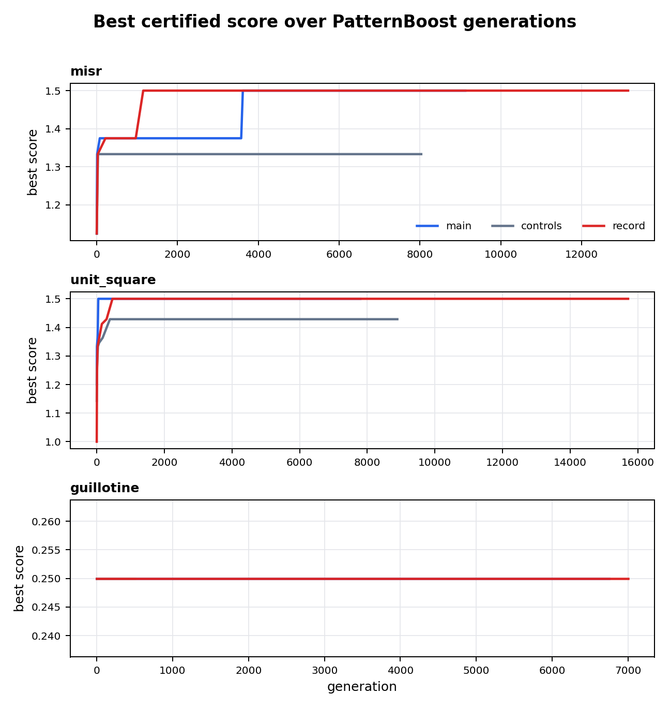
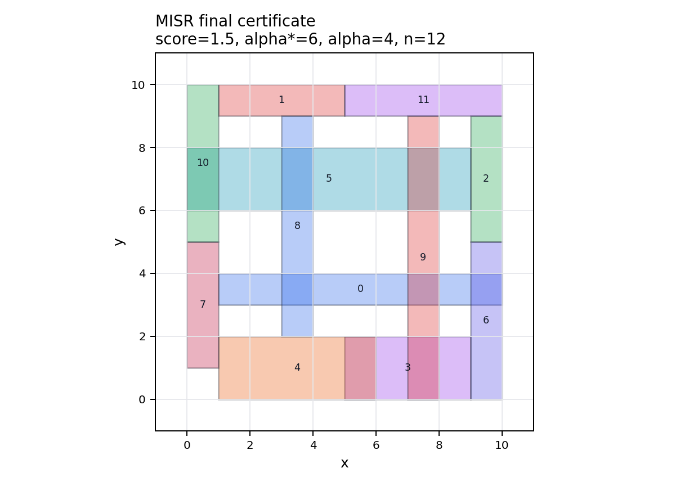
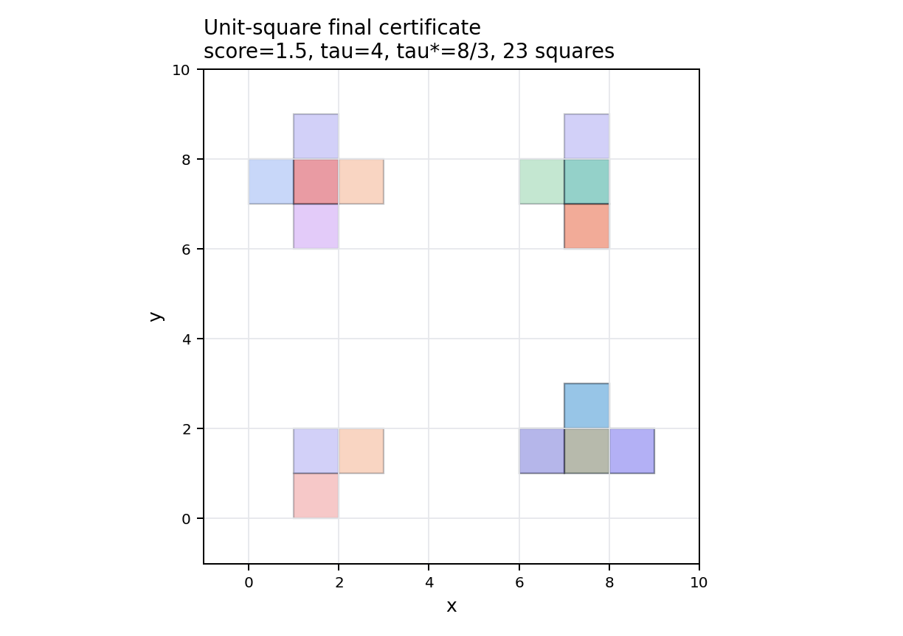
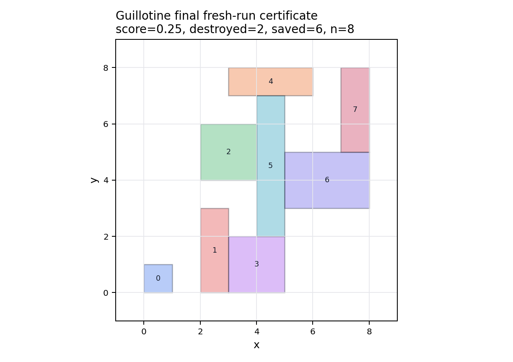
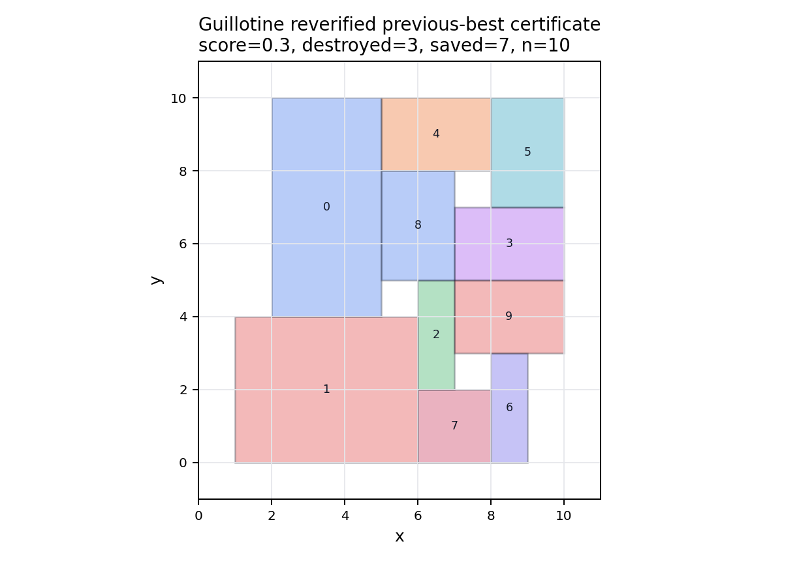

# Final PatternBoost Experiment Report

Updated: 2026-07-09

Repository: `patternboost-multilevel`

Final deployed commit: `8dd31ca1c8888dff0f1975ccbd38963d73b78b38`

Final run root on NYUAD Jubail:

```text
/home/sg9396/patternboost/multi-level-8dd31ca1c888/runs/final_submission_20260708_131302
```

Compact artifacts preserved in git:

```text
docs/assets/final_submission_20260708_131302/
```

The formal PDF version is:

```text
docs/manuscript/patternboost_experiment_report.pdf
```

## Scope

The main table covers only:

- `misr`
- `unit_square`
- `guillotine`

The exploratory `epsilon_net` and `graph_separation` tasks remain separate
appendix evidence. The discarded `square-stabbing-14-9` package is excluded.

## Final Fresh-Run Results

| Problem | Certified score | Stage | Winning configuration | Certificate |
| --- | ---: | --- | --- | --- |
| `misr` | `1.5` | main | `triangle_free_rect / program_coeff_pivot / triangle_free_exact_gap_pressure` | `docs/assets/final_submission_20260708_131302/certificates/main_misr_1.5.json` |
| `unit_square` | `1.5000000000000004` | main | `line_square_incidence / primal_dual_lines / exact_stab_gap_pressure` | `docs/assets/final_submission_20260708_131302/certificates/main_unit_square_1.5.json` |
| `guillotine` | `0.25` | main | `rect_direct_disjoint / recursive_gadget_assembly / depth_limited_dp` | `docs/assets/final_submission_20260708_131302/certificates/main_guillotine_0.25.json` |

Record follow-up tied these values:

| Problem | Record score | Winning configuration |
| --- | ---: | --- |
| `misr` | `1.5` | `triangle_free_rect / lp_dual_pivot / triangle_free_exact_gap_pressure` |
| `unit_square` | `1.5000000000000004` | `line_square_incidence / coord_mutation / exact_stab_gap_pressure` |
| `guillotine` | `0.25` | `recursive_obstruction_grammar / recursive_gadget_assembly / depth_limited_dp` |

## Audit Summary

| Stage | Slurm job | Rows | Summaries | Audit passed | Audit failed | Stderr |
| --- | --- | ---: | ---: | ---: | ---: | ---: |
| smoke | `16566068` | 3 | 3 | smoke only | smoke only | 0 |
| main | `16566072` | 81 | 81 | 76 | 5 | 0 |
| controls | `16566073` | 9 | 9 | 9 | 0 | 0 |
| record | `16566074` | 12 | 12 | 11 | 1 | 0 |

The failed audit rows have no `best_certificate_path`; no claimed certificate
failed exact recomputation.

## Reverified Previous-Best Guillotine Certificate

A previous-best guillotine certificate with score `0.3` is preserved and
reverified under the final deployed code:

```text
docs/assets/final_submission_20260708_131302/reverified_previous_best/guillotine_0p30_reverification.json
```

It recomputes as:

```text
n = 10
saved = 7
destroyed = 3
score = 0.3
```

This can be cited as a reverified previous-best certificate. It should not be
described as rediscovered by the fresh final record array.

## Figures

Learning curves:



MISR final certificate:



Unit-square final certificate:



Fresh final guillotine certificate:



Reverified previous-best guillotine certificate:



## Methodological Summary

### MISR

The exact score is `alpha_lp / alpha_int`. The final certificate has
`alpha_lp = 6`, `alpha_int = 4`, and score `1.5` on 12 rectangles. The useful
search bias was sparse or triangle-free conflict structure with LP-pressure
local moves.

### Unit-square stabbing

The exact score is `tau_int / tau_lp`. The final main certificate has
`tau_int = 4`, `tau_lp = 8/3`, and score `1.5` on 23 squares. The useful search
bias was line-square incidence with exact set-cover scoring.

### Guillotine

The exact score is `destroyed / n`, where `destroyed = n - saved` under the
optimal recursive guillotine dynamic program. The fresh final run certifies
`2/8 = 0.25`. The previous-best `3/10 = 0.3` certificate is still valid under
the final code but was not rediscovered in the final fresh run.

## Manuscript Use

- Use the fresh final-array table for the primary reproducible table.
- Use the reverified guillotine `0.3` certificate only with explicit
  previous-best provenance.
- Do not cite rows that lack a certificate path.
- Keep exploratory appendix tasks separate from the three-problem table.
- Use `docs/assets/final_submission_20260708_131302/` as the artifact index.
